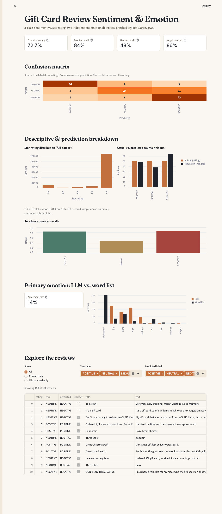

# Gift Card Review Sentiment & Emotion Classifier

An LLM-based sentiment classifier for Amazon "Gift Cards" reviews, checked against
star ratings, with two independent primary-emotion detectors and a Streamlit
dashboard for exploring the results. Built for MBAX 6418 Assignment 1.



## Data source

[Amazon Reviews '23](https://amazon-reviews-2023.github.io), collected by the
McAuley Lab at UC San Diego — specifically the **Gift Cards** category
([`Gift_Cards.jsonl.gz`](https://mcauleylab.ucsd.edu/public_datasets/data/amazon_2023/raw/review_categories/Gift_Cards.jsonl.gz)),
152,410 reviews. Emotion word list: the **NRC Word-Emotion Association Lexicon**
(Mohammad, S.M. & Turney, P.D., 2013, *"Crowdsourcing a Word-Emotion Association
Lexicon,"* Computational Intelligence, 29(3), 436-465 —
[saifmohammad.com/WebPages/NRC-Emotion-Lexicon.htm](https://saifmohammad.com/WebPages/NRC-Emotion-Lexicon.htm)).
Both are downloaded on first run and cached under `data/` (not committed — large
and re-downloadable).

## Method

- **Sentiment prompt** ([`src/prompt.py`](src/prompt.py)): given only a review's
  title and text (never the rating), an OpenAI model (`gpt-4o-mini`) returns a
  structured JSON verdict — sentiment class, a one-line rationale, and (from
  Step 5 on) a primary emotion — via OpenAI's structured outputs / JSON schema,
  so responses are always machine-readable.
- **Scoring** ([`src/score.py`](src/score.py)): runs a batch of reviews through
  the prompt and checks predictions against a rating-derived label the model
  never sees. Two runs are saved:
  - `results/run_2class_first100.json` — first 100 reviews in file order,
    2-class (rating ≥4 = POSITIVE, else NEGATIVE).
  - `results/run_3class_balanced150.json` — ~50 reviews per class, drawn with a
    fixed seed (`42`), 3-class (4-5=POSITIVE, 3=NEUTRAL, 1-2=NEGATIVE).
- **Word-list emotion** ([`src/emotion_lexicon.py`](src/emotion_lexicon.py)):
  tokenizes each review and scores it against the 8 NRC emotion categories
  (anger, anticipation, disgust, fear, joy, sadness, surprise, trust), taking
  the highest-scoring emotion — no model calls, runs over the already-saved
  predictions.
- **Dashboard** ([`dashboard/app.py`](dashboard/app.py)): Streamlit app reading
  the saved run files — headline metrics, a confusion matrix, descriptive and
  prediction charts, an LLM-vs-word-list emotion comparison, and a filterable
  review table. Run with `streamlit run dashboard/app.py`.

## Results

### Step 2 — imbalanced 2-class (first 100 reviews, file order)

| | Accuracy | Support |
|---|---|---|
| Overall | **97.0%** (97/100) | 100 |
| POSITIVE | precision 98.9%, recall 97.9% | 93 |
| NEGATIVE | precision 75.0%, recall 85.7% | 7 |

### Step 6 — balanced 3-class (~50/class, seed=42)

| | Accuracy | Support |
|---|---|---|
| Overall | **72.7%** (109/150) | 150 |
| POSITIVE | precision 87.5%, recall 84.0% | 50 |
| NEUTRAL | precision 63.2%, recall 48.0% | 50 |
| NEGATIVE | precision 67.2%, recall 86.0% | 50 |

Confusion matrix (rows = true label, columns = predicted):

| | Predicted POSITIVE | Predicted NEUTRAL | Predicted NEGATIVE |
|---|---|---|---|
| **Actual POSITIVE** | 42 | 8 | 0 |
| **Actual NEUTRAL** | 5 | 24 | 21 |
| **Actual NEGATIVE** | 1 | 6 | 43 |

### Emotion detection: LLM vs. word list

| Run | Agreement |
|---|---|
| First 100 (2-class) | 18.0% (18/100) |
| Balanced 150 (3-class) | 14.0% (21/150) |

All raw numbers above are pulled directly from the saved JSON in `results/` and
match what's displayed live in the dashboard.

## Answers

**1. Why did the lopsided run look very accurate, and what did sampling equal
amounts of each class change?**
The first-100 batch is 93% POSITIVE because the dataset itself is 84.15% 5-star
(128,248 of 152,410 reviews) and another 4.39% 4-star — POSITIVE is the "easy"
class and dominates any in-order sample. Getting 97% accuracy there mostly means
"the model can recognize obviously positive gift-card reviews," which is a low
bar. Once classes are balanced to 50/class, overall accuracy drops to 72.7% and
a real weak point appears: NEUTRAL recall is only 48%, far below POSITIVE (84%)
and NEGATIVE (86%). The imbalanced run couldn't reveal this because it had only
7 NEGATIVE examples and effectively no NEUTRAL examples to fail on.

**2. Where do the model's mistakes go — which classes get confused with which,
and in what direction?**
From the balanced confusion matrix: of 50 true NEUTRAL (3-star) reviews, **21
get called NEGATIVE** and 5 get called POSITIVE — only 24 are correctly kept as
NEUTRAL. The reverse direction is much rarer: of 50 true NEGATIVE reviews, only
6 get called NEUTRAL (and just 1 called POSITIVE). So the confusion is
asymmetric and skews in one direction: **3-star reviews collapse into NEGATIVE
far more often than negative reviews get softened into NEUTRAL** (21 vs. 6).
The model reads mild complaints ("a little slow," "packaging was rough") as
negative rather than as lukewarm-neutral.

**3. How do the LLM's emotions and the word list's emotions differ, and why?**
Agreement is low in both runs (18% and 14%). The LLM's answers cluster heavily
around **joy** (dominant in the positive-skewed first-100 run) because it reads
the review holistically — a short "great, fast, thanks!" review reads as joy
even with few emotion-coded words. The NRC word list instead answers
**anticipation** most often, because gift-card review vocabulary — "gift,"
"birthday," "occasion," "spree," "surprise" — happens to sit in NRC's
anticipation word list, regardless of whether the review's overall tone is
positive, negative, or neutral. In short: the LLM infers emotion from tone and
context; the lexicon can only count matching words, and gift-related vocabulary
systematically pulls it toward "anticipation" even on reviews the LLM reads as
plainly happy, angry, or flat.

**4. What bugs and/or issues came up, and how were they worked around?**
- The NRC lexicon's official download (`saifmohammad.com`) returned `406 Not
  Acceptable` for Python's default `requests` user-agent (curl worked fine) —
  fixed by sending a browser-like `User-Agent` header.
- Streamlit's built-in `st.metric` truncates its label/value with
  `white-space: nowrap` + `overflow: hidden` set on **nested** internal
  elements (not the outer container), so a first attempt at custom CSS on the
  outer `stMetric` div had no visible effect — labels like "Overall accuracy"
  rendered as "Overall ac…" at normal window widths. Fixed by targeting the
  inner `<p>`/markdown-container elements directly and forcing
  `white-space: normal`. This is exactly the kind of "small chart/label
  element collapse" bug the assignment warns about, just from CSS specificity
  rather than pixel width.
- The project's dev-server preview tool couldn't launch the Streamlit process
  because of a macOS permission restriction on programmatic access to files
  under `~/Desktop` — worked around by starting `streamlit run` directly and
  pointing the browser at `localhost` instead of going through the preview
  launcher.
- Automating a full-page dashboard screenshot (for this README) via headless
  Chrome initially produced a screenshot with a huge blank area at the bottom,
  because the page-height detection picked up the review table's internal
  virtualized scroll container (which reports a large `scrollHeight` for rows
  not currently rendered) instead of the actual visible page height. Fixed by
  measuring the height of Streamlit's own main content container specifically.

## Reproducing this

```bash
python3 -m venv venv
source venv/bin/activate
pip install -r requirements.txt

echo "OPENAI_API_KEY=sk-..." > .env

# confirm the data loads (downloads + caches Gift_Cards.jsonl.gz)
python src/data.py

# Step 2: imbalanced 2-class batch
python src/score.py --mode first100 --emotion
python src/emotion_lexicon.py results/run_2class_first100.json

# Step 6: balanced 3-class batch (the required deliverable run)
python src/score.py --mode balanced
python src/emotion_lexicon.py results/run_3class_balanced150.json

# dashboard
streamlit run dashboard/app.py
```

## Repository structure

```
src/data.py               data loading, label rules, balanced sampling (seed=42)
src/prompt.py              the reusable structured classification + emotion prompt
src/score.py                the scoring script (Steps 2 & 6)
src/nrc_lexicon.py           NRC emotion lexicon fetch/cache
src/emotion_lexicon.py        the word-list emotion script (Step 5)
dashboard/app.py               the dashboard generator (Streamlit)
results/run_2class_first100.json    Step 2 raw output
results/run_3class_balanced150.json Step 6 raw output (balanced run)
screenshots/                          dashboard screenshots
```

---
